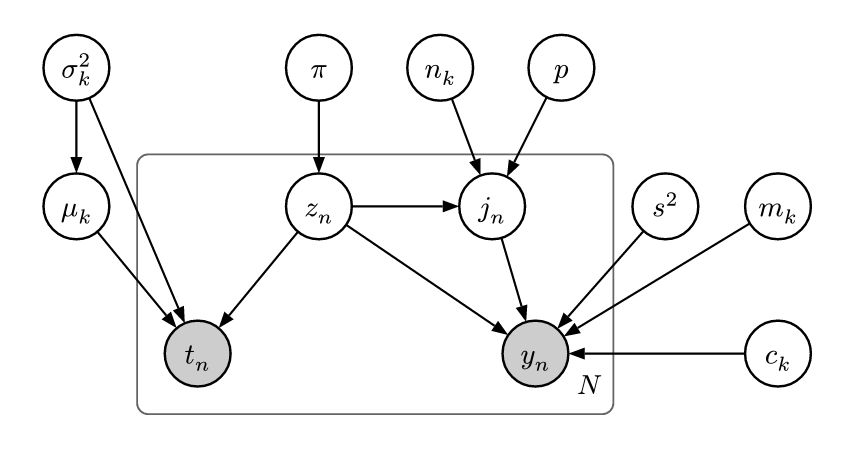
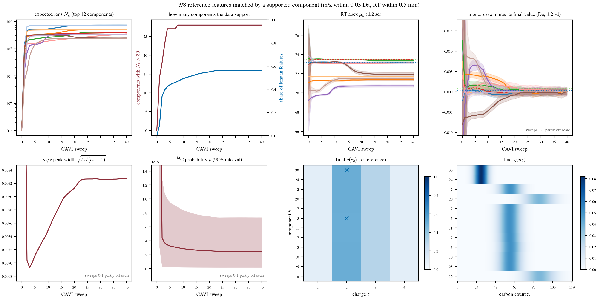
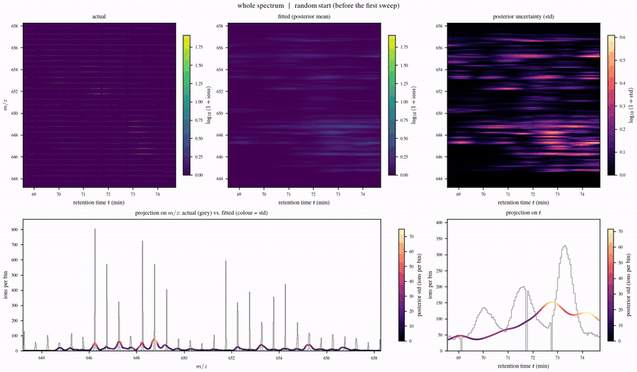

# Coordinate Ascent Variational Inference for LC-MS Detection

An LC–MS map is treated as a weighted point cloud in (retention time, m/z). Each pixel is generated either by one of
$K$ features or by a uniform background. A feature has a Gaussian elution profile in RT and an isotope comb in m/z,
whose peak heights follow a binomial in the carbon count $n_k$ and the <sup>13</sup>C probability $p$. RT and m/z are
conditionally independent given the feature. We derive coordinate-ascent variational inference (CAVI) updates for all
factors of a structured mean-field approximation.

**Full derivation and results: [lfq.pdf](lfq.pdf)** (source: [lfq.typ](lfq.typ)).

## Graphical model



Shaded nodes are observed. Variables with index $k$ exist once per feature (plate over $K$ omitted); $p$ and $s^2$ are
global. Hyperparameters are not shown.

## Variables

| Symbol | Meaning | Scope | Type |
|---|---|---|---|
| $z_n$ | feature assignment of pixel $n$ ($z_n = 0$: background) | pixel | latent, categorical |
| $j_n$ | isotope index: number of <sup>13</sup>C atoms of the ion | pixel | latent, discrete |
| $t_n$ | retention time | pixel | observed |
| $y_n$ | m/z | pixel | observed |
| $w_n$ | effective ion count (weight) | pixel | observed |
| $\pi_k$ | relative abundance of feature $k$ ($\pi_0$: background) | global | latent |
| $\mu_k$ | apex retention time | feature | latent |
| $\sigma_k^2$ | RT variance (elution width) | feature | latent |
| $m_k$ | monoisotopic m/z | feature | latent |
| $c_k$ | charge, $c_k \in \{1, 2, 3, 4\}$ | feature | latent, discrete |
| $n_k$ | number of carbon atoms | feature | latent, discrete |
| $p$ | <sup>13</sup>C probability | global | latent |
| $s^2$ | m/z peak variance | global | latent |
| $\Delta$ | <sup>13</sup>C – <sup>12</sup>C mass difference (1.00336 Da) | – | constant |

## Result

CAVI started from 30 randomly scattered features on the OpenMS example map (the FeatureFinder features serve only as
answer key). Every panel is explained in [lfq.pdf](lfq.pdf), section "Plots and results".



### Full video: actual map, fitted map and its uncertainty

[](plots/cavi_real/fit_full.mp4)

Preview as GIF; click for the [mp4](plots/cavi_real/fit_full.mp4). Top: actual map, fitted expected map, posterior
std of the expected counts. Bottom: projections on m/z and RT. Frame 0 is the random start, one frame per sweep.

## Run

```bash
make test            # test suite
make spectrum        # simulate an LC-MS map (mzML) in data/
make algorithm       # CAVI from random features, writes plots and videos to plots/cavi_real
make pdf             # build lfq.pdf from lfq.typ
make readme-assets   # graphical model image and the preview GIF used above
```
